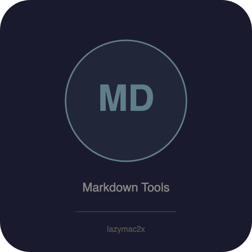

<p align="center"></p>

[](https://lazymac2x.github.io/lazymac-api-store/) [](https://coindany.gumroad.com/) [](https://mcpize.com/mcp/markdown-tools-api)

# markdown-tools-api

[](https://www.npmjs.com/package/@lazymac/mcp)
[](https://smithery.ai/server/lazymac/mcp)
[](https://coindany.gumroad.com/l/zlewvz)
[](https://api.lazy-mac.com)

> 🚀 Want all 42 lazymac tools through ONE MCP install? `npx -y @lazymac/mcp` · [Pro $29/mo](https://coindany.gumroad.com/l/zlewvz) for unlimited calls.

Markdown processing REST API and MCP server. Convert between Markdown, HTML, and plain text. Extract structure, TOC, links, code blocks. Lint and validate.

## Quick Start

```bash
npm install
npm start          # REST API on http://localhost:3900
npm run mcp        # MCP server over stdio
```

## Endpoints

| Method | Path | Description |
|--------|------|-------------|
| GET | `/health` | Health check |
| POST | `/api/v1/md-to-html` | Markdown to HTML |
| POST | `/api/v1/html-to-md` | HTML to Markdown |
| POST | `/api/v1/md-to-text` | Markdown to plain text |
| POST | `/api/v1/extract-toc` | Extract table of contents |
| POST | `/api/v1/extract-links` | Extract all links |
| POST | `/api/v1/extract-code` | Extract code blocks |
| POST | `/api/v1/stats` | Word count, reading time |
| POST | `/api/v1/lint` | Lint / validate markdown |

## Example

```bash
curl -X POST http://localhost:3900/api/v1/md-to-html \
  -H "Content-Type: application/json" \
  -d '{"markdown": "# Hello\n\nWorld **bold**"}'
```

## MCP Server

Add to your MCP client config:

```json
{
  "mcpServers": {
    "markdown-tools": {
      "command": "node",
      "args": ["/path/to/markdown-tools-api/src/mcp-server.js"]
    }
  }
}
```

Available tools: `md_to_html`, `html_to_md`, `md_to_text`, `extract_toc`, `extract_links`, `extract_code`, `stats`, `lint`.

## Docker

```bash
docker build -t markdown-tools-api .
docker run -p 3900:3900 markdown-tools-api
```

## License

MIT

<sub>💡 Host your own stack? <a href="https://m.do.co/c/c8c07a9d3273">Get $200 DigitalOcean credit</a> via lazymac referral link.</sub>
